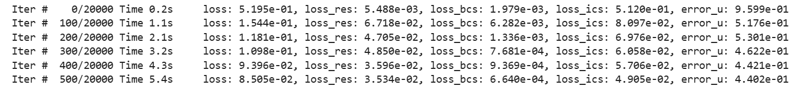
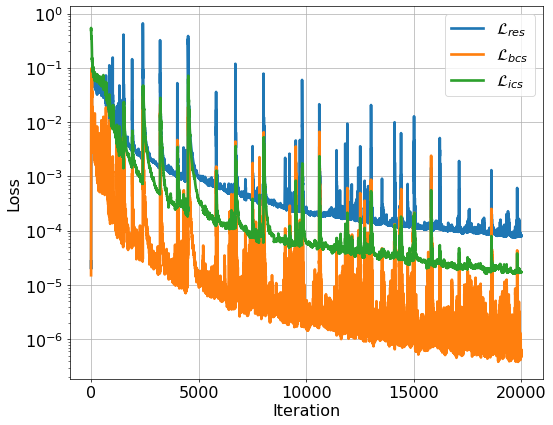
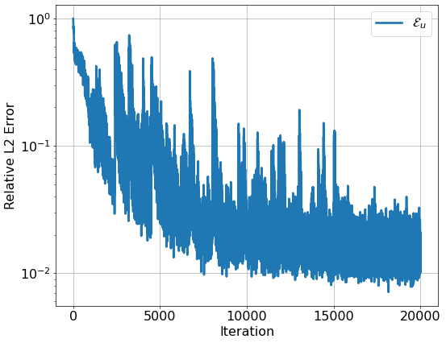
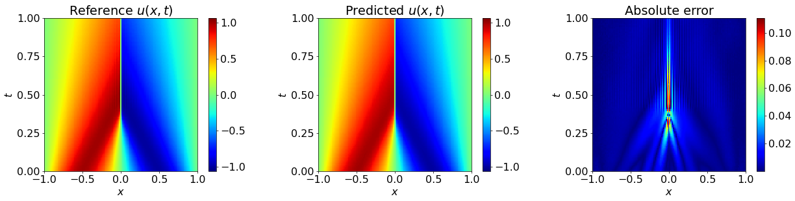

# PDEasy ​(​0​.​1​.​0​)​ :zap:

[](https://pypi.org/project/pdeasy/)
[](https://opensource.org/licenses/MIT)
[](https://your-docs-url)

**PDEasy: Lightweight PINN-PDE Solver for Research, Balancing Abstraction and Flexibility for Algorithm Innovation.**

> **Note:** 目前, 关于 PINN (Physics-Informed Neural Networks) 的 Python 库大都封装程度较高, 主要面向工程部署或新手入门. 然而, 对于 PINN 相关科研工作者来说, 通过较高封装的代码去实现自己的 idea 是非常困难的. 因此, 我们希望写一套面向科研工作者的 PINN-PDE 求解库, 平衡封装程度与扩展性, 使得用户能够快速实现新的 idea, 加速算法创新.

## :rocket: Key Features

### 1. PINN 求解流程化

- **PINN 求解流程**规范为: 定义超参数, 定义数据集, 定义网络模型, 定义 PINN 模型, 训练模型, 评估与可视化.

- 其中, 各种**网络**模型, **PINN 正反问题**模型, 可视化模块等都实现了封装, 并提供了扩展接口.
- 尤其是对于 PINN 特有的对输入坐标**求偏导**, 也实现了简化.

### 2. 可以灵活扩展自己的 idea

- 框架内的数据, 例如**采样点**和 **loss** 信息, 都**以 dict 的形式流动**, 用户可以轻松地读取或加入信息, 并融合采样和权重等算法.
- 未封装训练模块, 使用户更容易修改训练过程.
- PINN 模型提供了良好的扩展接口, 可以融合各种网络, 或增加各种计算方式.

### 3. 全面的训练信息监控

- 训练过程中的 **loss** 和 **error**, 都可以通过封装模块快速计算, 并存储到 **logger** 中.
- 可视化模块可以直接通过 logger 绘图, 展示训练过程的各项 loss 和 error 的变化.

> **Note:** PDEasy 基于 PyTorch, NumPy, Matplotlib 等主流 Python packages.

## :package: Installation

目前仅支持下载压缩包使用.

> **Note:** 由于我们不是计算机出身, 所以这个项目比较朴素, 仅仅从日常科研需求沉淀形成. 后续完善后会增加安装方法.

## :hourglass_flowing_sand: Quick Start
这里我们以 Burgers 方程正问题为例, 介绍 PDEasy 的使用方法.

> **Note:** 在 `example`文件夹中, 我们实现了 1D, 2D 空间 (和时间)的算例, 包括正问题和反问题, 共有 7 个. 其中, 结合了 MLP, ResNet, Fourier Feature Network, Multi-Head Network 等各种网络类型, 以及展示了边界约束, 尺度放缩, 自适应 loss 权重等算法的融合, 后续会公开更多的算例.

### 0. 导入库

```python
import os
import numpy as np
import scipy.io as io
import torch
import torch.nn as nn
import torch.optim as optim

# 为了导入 PDEasy 项目文件
import sys
sys.path.append("../../")

from dataset import Dataset1DT
from pinn import PINNForward
from network import MLP
from utils import *
from plotting import *
```

### 1. 定义超参数

```python
DATA_DIR = './data'
FIGURE_DIR = './figure'
LOG_DIR = './log'
MODEL_DIR = './model'

DOMAIN = (-1, 1, 0, 1)  # (x_min, x_max, t_min, t_max)
N_RES = 2000
N_BCS = 200
N_ICS = 200
N_ITERS = 20000
NN_LAYERS = [2] + [40]*4 + [1]
```

### 2. 定义数据集

```python
class Dataset(Dataset1DT):
    def __init__(self, domain):
        super().__init__(domain)

    def custom_update(self, n_res=N_RES, n_bcs=N_BCS, n_ics=N_ICS):
        self.interior_random(n_res)
        self.boundary_random(n_bcs)
        self.initial_random(n_ics)
```

### 3. 定义 PINN 模型

```python
class PINN(PINNForward):
    def __init__(self, network_solution, should_normalize=True):
        super().__init__(network_solution, should_normalize)

    def forward(self, data_dict):
        # 读取 data_dict 的数据
        X_res, X_bcs, X_ics = data_dict["X_res"], data_dict["X_bcs"], data_dict["X_ics"]

        # 计算 point-wise loss
        # 便于后续引入权重策略
        loss_dict = {}
        loss_dict['pw_loss_res'] = self.net_res(X_res) ** 2
        loss_dict['pw_loss_bcs'] = self.net_bcs(X_bcs) ** 2
        loss_dict['pw_loss_ics'] = self.net_ics(X_ics) ** 2

        return loss_dict
    
    def net_res(self, X):
        x, t = self.split_X_columns_and_require_grad(X)
        u = self.net_sol([x, t])

        u_x = self.grad(u, x, 1)  # 更简单的求导写法
        u_t = self.grad(u, t, 1)
        u_xx = self.grad(u, x, 2)
        res_pred = u_t + u * u_x - (0.01 / torch.pi) * u_xx
        return res_pred
    
    def net_bcs(self, X):
        u = self.net_sol(X)
        bcs_pred = u - 0
        return bcs_pred
    
    def net_ics(self, X):
        u = self.net_sol(X)
        ics_pred = u + torch.sin(torch.pi * X[:, [0]])
        return ics_pred
```

### 4. 训练模型

#### 4.1 导入参照解

```python
init_dir(DATA_DIR, FIGURE_DIR, LOG_DIR, MODEL_DIR)

data = io.loadmat(os.path.join(DATA_DIR, 'Burgers_Sol.mat'))
u = data['u']  # shape (N_t, N_x)
x = data['x'].flatten()
t = data['t'].flatten()

u_shape = u.shape
xx, tt = np.meshgrid(x, t)
xx, tt, u = xx.flatten(), tt.flatten(), u.flatten()

X = np.stack([xx, tt], axis=1)
```

#### 4.2 初始化训练实例

```python
dataset = Dataset(DOMAIN)

network = MLP(NN_LAYERS)
pinn = PINN(network)
pinn.mean, pinn.std = dataset.data_dict['mean'], dataset.data_dict['std']

optimizer = optim.Adam(pinn.parameters(), lr=0.001)

log_keys = ['iter', 'loss', 'loss_res', 'loss_bcs', 'loss_ics', 'error_u']
logger = Logger(LOG_DIR, log_keys, num_iters=N_ITERS, print_interval=100)

```

#### 4.3 训练

```python
best_loss = np.inf
for it in range(N_ITERS):
    pinn.zero_grad()                                        # 清除梯度
    loss_dict = pinn(dataset.data_dict)                     # 计算 point-wise loss
    
    pw_loss_res = loss_dict["pw_loss_res"]                  # 提取 point-wise loss
    pw_loss_bcs = loss_dict["pw_loss_bcs"]
    pw_loss_ics = loss_dict["pw_loss_ics"]
    
    loss_res = torch.mean(pw_loss_res)                      # 计算 loss
    loss_bcs = torch.mean(pw_loss_bcs)
    loss_ics = torch.mean(pw_loss_ics)
        
    loss = loss_res + loss_bcs + loss_ics
    
    loss.backward()                                         # 反向传播    
    optimizer.step()                                        # 更新网络参数

    error_u, _ = relative_error_of_solution(pinn, ref_data=(X, u), num_sample=500)

    logger.record(                                          # 保存训练信息
        iter=it,                                            # 每隔一定次数自动打印
        loss=loss.item(),
        loss_res=loss_res.item(),
        loss_bcs=loss_bcs.item(),
        loss_ics=loss_ics.item(),
        error_u=error_u
    )
    
    if it % 100 == 0:
        dataset.update()
    
    if loss.item() < best_loss:                             # 保存最优模型
        model_info = {
            'iter': it,
            'nn_sol_state': pinn.network_solution.state_dict(),
            'mean': pinn.mean,
            'std': pinn.std,
        }
        torch.save(model_info, os.path.join(MODEL_DIR, 'model.pth'))
        best_loss = loss.item()

logger.print_elapsed_time()
logger.save()
```



### 5. 评估与可视化

#### 5.1 导入训练信息以及模型参数

```python
logger.load()

model_info = torch.load(os.path.join(MODEL_DIR, 'model.pth'))
pinn.network_solution.load_state_dict(model_info['nn_sol_state'])
pinn.mean, pinn.std = model_info['mean'], model_info['std']
pinn.eval()
```

#### 5.2 可视化 loss 和 error

```python
plot_loss_from_logger(logger, FIGURE_DIR, show=True)
plot_error_from_logger(logger, FIGURE_DIR, show=True)
```





#### 5.3 可视化 solution

```python
error_u, u_pred = relative_error_of_solution(pinn, ref_data=(X, u))

print('Relative l2 error of u: {:.3e}'.format(error_u))
with open(os.path.join(LOG_DIR, 'relative_error.txt'), 'w') as f_obj:
    f_obj.write('Relative l2 error of u: {:.3e}\n'.format(error_u))

plot_solution_from_data(
    FIGURE_DIR, 
    x_grid=xx.reshape(u_shape),
    y_grid=tt.reshape(u_shape),
    sol=u.reshape(u_shape),
    sol_pred=u_pred.reshape(u_shape),

    x_label='$x$',
    y_label='$t$',

    x_ticks=np.linspace(-1, 1, 5),
    y_ticks=np.linspace(0, 1, 5),
    
    title_left=r'Reference $u(x,t)$',
    title_middle=r'Predicted $u(x,t)$',
    title_right=r'Absolute error'
)
```



## :books: Documentation
TODO.

## :handshake: Contributing
我们欢迎更多开发者加入, 请联系:

- 邮箱 guanyu191@163.com
- 微信 guanyu191

> **Note:** PDEasy 前身由数据谷团队的潘冠宇和徐梓锟在 2023 年 1 月根据团队科研需求开发, 当时主要用于 PINN 求解反问题. 在 2025 年 2 月, 我们重新改进代码, 面向 PINN 领域科研工作者, 开发了 PDEasy 库. 往后我们会进一步完善, 支持更多的 PDE 正反问题.

## :scroll: License
MIT License. See [LICENSE](LICENSE) for details.

## :star: Citation
If using PDEasy in research:
```bibtex
@software{PDEasy,
  author = {Guanyu Pan},
  title = {PDEasy: Lightweight PINN-PDE Solver for Research, Balancing Abstraction and Flexibility for Algorithm Innovation.},
  year = {2025},
  publisher = {GitHub},
  howpublished = {\url{https://github.com/Guanyu191/PDEasy}},
}
```
